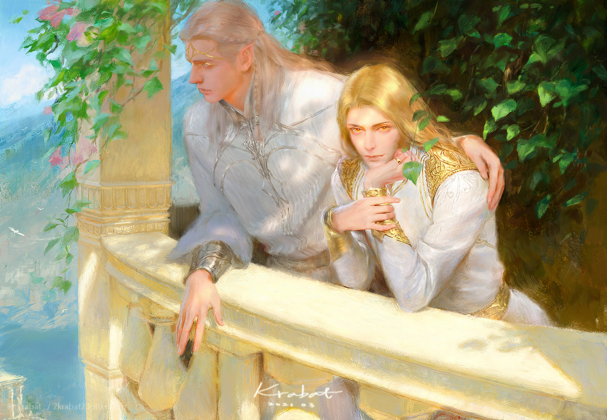
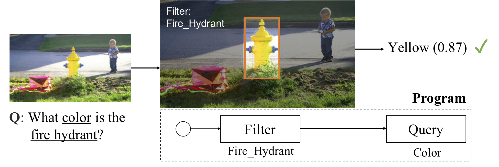
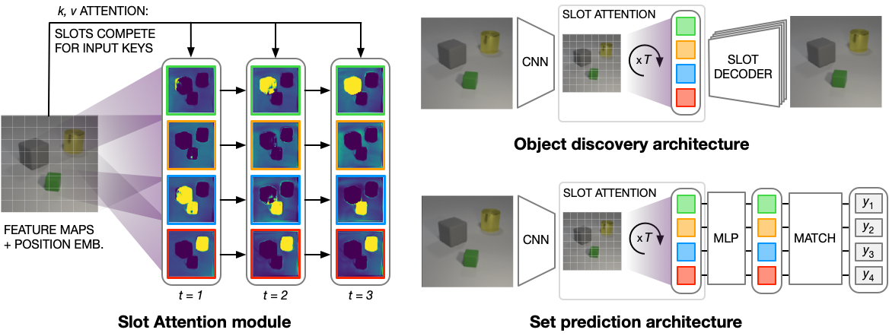
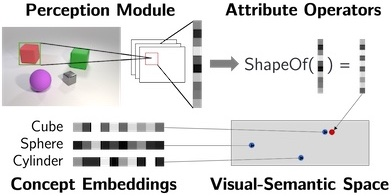
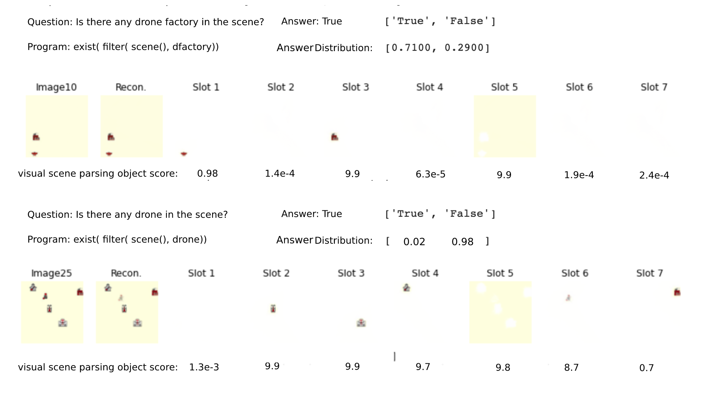
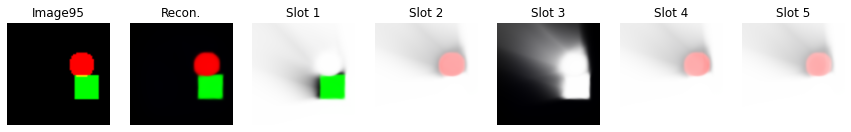
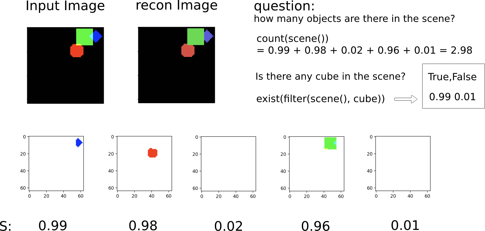
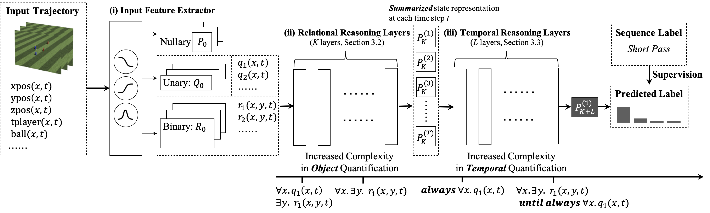
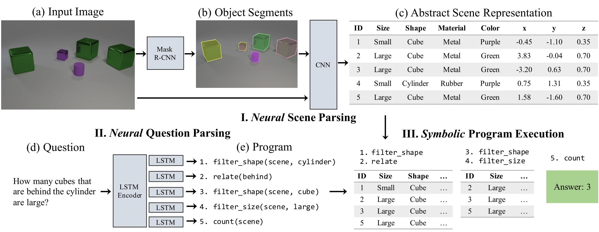
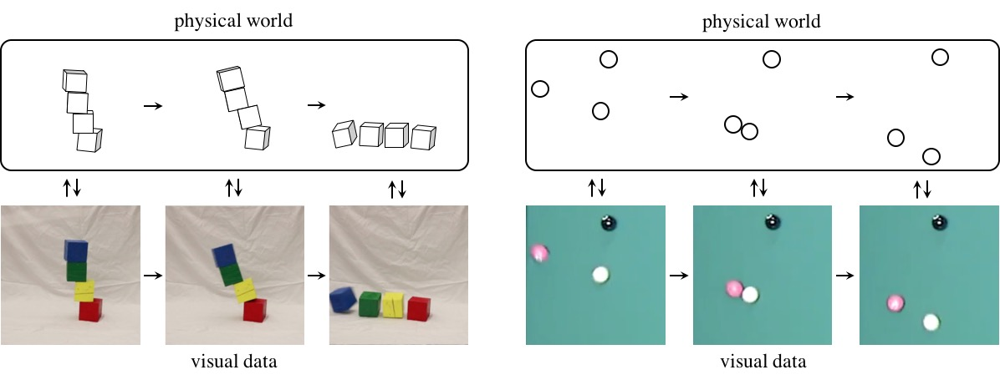

# Valarauka

<div align = 'center'>

[](./LICENSE)
[](https://www.python.org/)
[](https://www.docker.com/) 
[](https://github.com/Mustard404/Savior/) 
[](https://github.com/Mustard404/Savior/)
</div>

## Background
This repo is aimed to create a machine that learns continuously from their environment and performs planning and reasoning using past knowledge. Currently, we aim to solve the following problems:
- unsupservised segmentation and factored visual scene representation
- natural language question parsing and answering based on the knowledge base.
- knowledge based question answering and visual question answering 
- dynamic prediction over object-centric videos

mark :white_check_mark: means solved.

## Frame Work
Our model builds an object-based scene representation and translates sentences into executable, symbolic programs. To bridge the learning of two modules, we use a neuro-symbolic reasoning module that executes these programs on the latent scene representation. Analogical to human concept learning, the perception module learns visual concepts based on the language description of the object being referred to. Meanwhile, the learned visual concepts facilitate learning new words and parsing new sentences. We use curriculum learning to guide the searching over the large compositional space of images and language. Extensive experiments demonstrate the accuracy and efficiency of our model on learning visual concepts, word representations, and semantic parsing of sentences. Further, our method allows easy generalization to new object attributes, compositions, language concepts, scenes and questions, and even new program domains. It also empowers applications including visual question answering and bidirectional image-text retrieval.



This repo consists following components:
- visual perception module:Given the input image, we generate object proposals, and extract visual representations for each of the proposal.
- langugage parsing module:The semantic parsing module translates a natural language question into an executable program with a hierarchy of primitive operations. Each concept in the program corresponds to a vector embedding that is jointly trained.
- structured knowledge module:nGiven the recovered program, a symbolic program executor executes the program and derives the answer based on the object-based visual representation and the concept embeddings. Our program executor is a collection of deterministic functional modules.
### visual perception module
currenty there are two big categories of visual perception module - the supervised and unsupervised methods. Supervised methods use a pre-trained object detection module to recognize
objects appreared in the scene. Convenient though, is suffers from strong supervision over images and captions.

### neuro symbolic knowledge structure


## Main Function
 This repository provides a model that supports unsupervised image segmentation and object centric concept learning. And based on these representations the knowledge-base, it is capable of learning to answer simple questions via neuro-symbolic programs. The next update of this repository will be about how to learn to generate representation and answer questions on a continuous video domain.
# Model
 The model contains mainly 3 models: 1) the scene-graph parser 2) query-to-program parser 3) neuro-symbolic knowlege base. In this section, we record several modules that are used in this repo with some basic explanations.

## Slot Attention
This module is used to parse objects from the scene. Original paper Object-Centric Learning with Slot Attention is from [here](https://github.com/lucidrains/slot-attention).
The general framework of the slot attention object parser model:

```bibtex
@misc{locatello2020objectcentric,
    title = {Object-Centric Learning with Slot Attention},
    author = {Francesco Locatello and Dirk Weissenborn and Thomas Unterthiner and Aravindh Mahendran and Georg Heigold and Jakob Uszkoreit and Alexey Dosovitskiy and Thomas Kipf},
    year = {2020},
    eprint = {2006.15055},
    archivePrefix = {arXiv},
    primaryClass = {cs.LG}
}
```
This is a reference implementation for "Object-Centric Learning with Slot Attention" (https://arxiv.org/abs/2006.15055) by Francesco Locatello, Dirk Weissenborn, Thomas Unterthiner, Aravindh Mahendran, Georg Heigold, Jakob Uszkoreit, Alexey Dosovitskiy, and Thomas Kipf.
we did several modifications over the original-slot attention module; to perserve the permutation invariant over the slot layer, GRU update cells are ignored and to make the background aware version, the first slot and the second slot used gaussian distribution with different parameters.


## Cone Concept Space
the cone concept space is first used in the "Neuro Symbolic Concept Learner".
<div align="center">



</div>

# Experiments
the experiment is currently performed on three different domains
- sprite qa, the domain that contains simple geometric concepts like diamond, sphere, cube etc.
- battlecode world, the domain that contains several interactive agents. Compared to sprite-qa, there are more objects present in the scene.
- ptr qa dataset

## Battlecode World
in this problem setting, the world consists of 7 different kinds of objects, and they are scattered across the map. And the agent is asked to answer 4 categories of questions. The model first parses the visual scene into factored object representations and then parse the natural language question into executable neuro-symbolic program; finally, the neuro-symbolic program is executed based on the structured knowledge representation (Box Space and Concept Cone). Two example outputs made by the model are shown below:



Two perception models --background-aware Slot-Attention and monet-- are used to parse the visual scene graph. Monet uses a recurrential attention to generate object masks and uses the kl-divergence over masks to restrict the mask distribution.

### Current Domain Specific Language

#### object level concepts and relations
- Object Category: dfactory,drone,dschool,hq,landscaper,miner,netgun,refinery,vaporator,lead,gold
- Spatial Relations: left,right,front,behind,above,below
- Geometric Relations: line-line perpendicular,line-line parallel,plane-plane perpendicular,plane-plane parallel, line-plane perpendicular,line-plane parallel
#### primitives for battlecode world
- scene : $s_i,f_i$, return the object set that is represented as log object score $s_i$ and object feature $f_i$
- filter: $min(s_i,q(o_i))$, return the elements in the set that is conisdered an object and posses the property $q$.
- count: $\sum_i e^{s_i}$, return the number of objects in the object set by tansforming the log-probability and sum up.
- exist: $max(s_i)$, return boolean distribution of the maximum probability of an object in the set for each object.
- query: return the log-probability of the input object belongs to certain category.
## Sprite Question Answer
In this problem, the visual dataset contains several obejects defined as simple geometric shapes.

An input sequence composed of relational states: each column represents the state of an entity that changes over time. A logic formula describes a complex concept or feature that is true of this temporal sequence using object and temporal quantification. The sequence is segmented into three stages: throughout the first stage, ■ holds for at least one entity, until the second stage, in which each entity is always either ■ or ■, until the third stage, in which eventually ■ becomes true for at least one of the entities. (b) Such events can be described using first-order linear temporal logic expressions. Our model can learn neuro-symbolic recognition models for such relational-temporal events from data.

Our model includes reasoning layers that implement finite-domain quantification over objects and time. The structure allows them to generalize directly to input instances with varying numbers of objects in temporal sequences of varying lengths. We evaluate TOQ-Nets on input domains that require recognizing event-types in terms of complex temporal relational patterns. We demonstrate that TOQ-Nets can generalize from small amounts of data to scenarios containing more objects than were present during training and to temporal warpings of input sequences.

# Dynamic Scene Question Answering
Our model includes reasoning layers that implement finite-domain quantification over objects and time. The structure allows them to generalize directly to input instances with varying numbers of objects in temporal sequences of varying lengths. We evaluate TOQ-Nets on input domains that require recognizing event-types in terms of complex temporal relational patterns. We demonstrate that TOQ-Nets can generalize from small amounts of data to scenarios containing more objects than were present during training and to temporal warpings of input sequences.

An input sequence composed of relational states: each column represents the state of an entity that changes over time. A logic formula describes a complex concept or feature that is true of this temporal sequence using object and temporal quantification. The sequence is segmented into three stages: throughout the first stage, ■ holds for at least one entity, until the second stage, in which each entity is always either ■ or ■, until the third stage, in which eventually ■ becomes true for at least one of the entities. (b) Such events can be described using first-order linear temporal logic expressions. Our model can learn neuro-symbolic recognition models for such relational-temporal events from data.


One important aspect for leanring the dynamic concept over videos is a good physics prediction engine. In this repo, the propagation network is used to learn physics over slots. At the core of our system is a physical world representation that is first recovered by a perception module and then utilized by physics and graphics engine. During training, the perception module and the generative model learn by visual de-animation -- evolve the observed slots by propagation over time and render them using the graphic decoder. During the testing, the system first recovers the physical world state, and then uses the generative models for reasoning and future prediction.


# Updates
2022.9.27 -- valarauka created

2022.10.1 -- update this readme.md

# Prerequisites
- torch
- torchvision
- torch_geometric
- melkor_engine
- melkor_knowledge