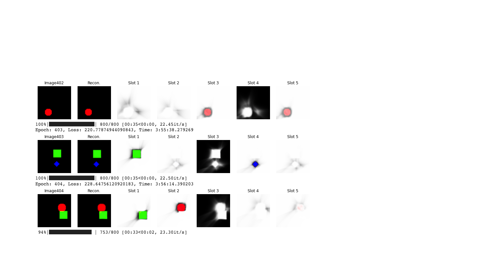
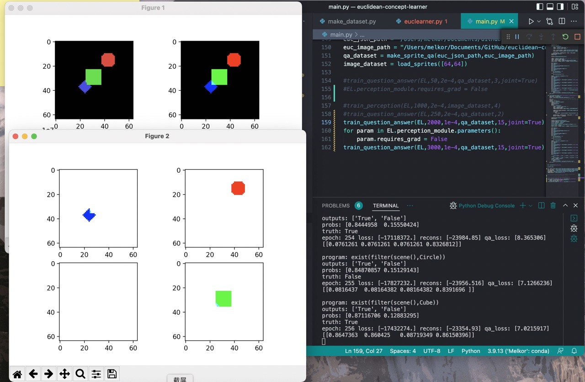

# Valarauka

 
 

## Background

## Frame Work
## Main Function
 This repository provides a model that supports unsupervised image segmentation and object centric concept learning. And based on these representations the knowledge-base, it is capable of learning to answer simple questions via neuro-symbolic programs. The next update of this repository will be about how to learn to generate representation and answer questions on a continuous video domain.
# Model
 The model contains mainly 3 models: 1) the scene-graph parser 2) query-to-program parser 3) neuro-symbolic knowlege base.

# Prerequisites
- torch
- torchvision
- torch_geometric
- melkor_engine
- melkor_knowledge

# Experiments
the experiment is currently performed on three different domains
- sprite qa, the domain that contains 
- battlecode world
- ptr qa dataset

## Battlecode World
in this problem setting, the world consists of 7 different kinds of objects and they are scattered across the map.

## Sprite Question Answer
In this problem, the visual dataset contains several obejects defined as simple geometric shapes.

